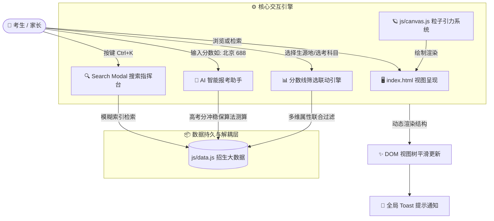

<div align="center">

# 🌌 星渊科技大学 (SCIST)
### StarCore Institute of Science and Technology · 本科招生官方门户

<p align="center">
  <b>格物求理 · 叩问苍穹</b><br>
  面向下一代青年科学家的超现代深空科幻极客风大学官方招生门户
</p>

<!-- Badges Section -->
<p align="center">
  <a href="https://xxwl12122.github.io/scist-admissions/">
    
  </a>
  <a href="https://github.com/xxwl12122/scist-admissions/commits/main">
    
  </a>
  <a href="https://github.com/xxwl12122/scist-admissions/blob/main/LICENSE">
    
  </a>
</p>

<p align="center">
  
  
  
  
  
  
</p>

---

### 🚀 快速行动与即时体验

<p align="center">
  <a href="https://xxwl12122.github.io/scist-admissions/">
    
  </a>
  &nbsp;&nbsp;
  <a href="https://xxwl12122.github.io/scist-admissions/#scores">
    
  </a>
  &nbsp;&nbsp;
  <a href="https://xxwl12122.github.io/scist-admissions/#majors">
    
  </a>
</p>

</div>

---

## 📸 项目全景概览

> **星渊科技大学 (StarCore Institute of Science & Technology, SCIST)** 是一所构想中的面向世界硬核战略前沿的新型研究型大学。本门户网站采用全响应式前端架构与流式渲染，打破传统高校招生网死板沉闷的静态排版，以极致的科幻极客美学为千万高考生提供扁平、透明、高响应度的数字招生新体验。

```
╔═══════════════════════════════════════════════════════════════════════════════╗
║   [ 2026星火计划拔尖选拔开启 ]  [ 历年分数速查 ]  [ AI 报考智能咨询助理 ]     ║
╠═══════════════════════════════════════════════════════════════════════════════╣
║   🌌 格物求理 · 叩问苍穹                                                      ║
║   ⚡ Canvas 自适应流体粒子网格 · 鼠标排斥引力场 · 点击星云爆发                ║
║   📊 18+ 国家重点实验室  |  42位 两院院士特聘  |  86.4% 本科直博深造率       ║
╠═══════════════════════════════════════════════════════════════════════════════╣
║   🔍 分数线动态筛选引擎   |  🏛️ 前沿书院 Bento Grid  |  🤖 AI 智能诊断顾问    ║
║   📷 校园实景全屏灯箱     |  📰 招考通告与宣讲速递   |  ⌨️ Ctrl+K 全局指挥台  ║
╚═══════════════════════════════════════════════════════════════════════════════╝
```

---

## 💎 六大核心特性矩阵 (Feature Matrix)

<table>
  <tr>
    <td width="50%" valign="top">
      <h3>🪐 1. 全景深空物理粒子星网</h3>
      <ul>
        <li><b>动态拓扑连线</b>：基于自适应视口的 Canvas 2D 粒子引擎，实时解算节点距离并在阈值内平滑绘制半透明神经元光缆。</li>
        <li><b>物理交互力场</b>：支持鼠标位移产生排斥力场及弹性阻尼，支持点击产生星云爆发粒子喷射。</li>
        <li><b>能效感知节流</b>：结合 <code>requestAnimationFrame</code> 与 <code>document.visibilitychange</code>，后台自动冻结渲染以节约功耗。</li>
      </ul>
      <p><code>Tag:</code> <code>HTML5 Canvas</code> <code>Physics Engine</code> <code>Interactive 2D</code></p>
    </td>
    <td width="50%" valign="top">
      <h3>📊 2. 招生录取多维大数据检索</h3>
      <ul>
        <li><b>秒级复合筛选</b>：联动“招生生源省份”、“选考科目要求(物化双选/综合改革)”、“基准年份”及“专业关键词”。</li>
        <li><b>位次梯队标示</b>：自动为 690+ 顶尖专业标注 🔥热度徽章，直观展示各省对应位次、拟招名额与投档分。</li>
        <li><b>无缝直达诊断</b>：支持从表格中一键唤起专属专业智能咨询，自动装配省份与专业上下文。</li>
      </ul>
      <p><code>Tag:</code> <code>Big Data Table</code> <code>Dynamic Filtering</code> <code>Zero Latency</code></p>
    </td>
  </tr>
  <tr>
    <td width="50%" valign="top">
      <h3>🤖 3. AI 招生咨询助理 Pro 旗舰版</h3>
      <ul>
        <li><b>数字指令快速响应</b>：键入 <code>1</code>（强基简章）、<code>2</code>（分数位次）、<code>3</code>（拔尖专业）、<code>4</code>（转专业）、<code>5</code>（极客生活）精准直达深度解答。</li>
        <li><b>高考志愿测算引擎</b>：输入如 <code>北京 688</code> 或 <code>685分</code>，实时比对真实基准线，推算“🎯冲刺 / ✅高度稳妥 / 🛡️绝对保底”梯度诊断。</li>
        <li><b>富文本动作卡片</b>：内嵌交互按钮，支持一键定位锚点、唤起模态弹窗及预约回访。</li>
      </ul>
      <p><code>Tag:</code> <code>AI Agent Engine</code> <code>Score Diagnostics</code> <code>Action Cards</code></p>
    </td>
    <td width="50%" valign="top">
      <h3>🏛️ 4. 前沿学科矩阵与拔尖培养</h3>
      <ul>
        <li><b>大类培养零门槛</b>：全校推行 <b>100%全自选转专业</b> 机制，转出不设绩点门槛，历史转专业成功率达 <b>98.7%</b>。</li>
        <li><b>六大硬核荣誉计划</b>：量子计算英才班、图灵计算机科学班、深空探测动力工程、受控核聚变与高温超导等。</li>
        <li><b>本硕博贯通直通车</b>：院士导师“一人一案”，大二全员进驻国家级大科学装置实验室。</li>
      </ul>
      <p><code>Tag:</code> <code>Bento Grid</code> <code>Honors College</code> <code>Curriculum Modal</code></p>
    </td>
  </tr>
  <tr>
    <td width="50%" valign="top">
      <h3>📷 5. 校园全维实景视界与灯箱</h3>
      <ul>
        <li><b>场景化分类滤镜</b>：科研大科学重器、品质极客生活、知识中枢寰宇书院三大维度自由切换。</li>
        <li><b>双向沉浸式灯箱</b>：点击弹出全屏高清大图，内置全景遮罩、照片序列计数器与描述面板。</li>
        <li><b>全键盘快捷操控</b>：全面支持键盘 <code>←</code> / <code>→</code> 左右箭头翻页及 <code>ESC</code> 键即刻退出。</li>
      </ul>
      <p><code>Tag:</code> <code>Lightbox Modal</code> <code>Keyboard Nav</code> <code>Image Gallery</code></p>
    </td>
    <td width="50%" valign="top">
      <h3>⚡ 6. 全局智能指挥台与微交互</h3>
      <ul>
        <li><b>全局快捷搜索</b>：支持 <code>Ctrl + K</code> / <code>⌘ + K</code> 呼出全站模糊搜索面板，秒级索引专业、动态与指南。</li>
        <li><b>平滑阅读进度指示</b>：顶部渐变流光进度条，根据用户滚动距离实时反映页面阅读进度。</li>
        <li><b>全局非阻塞 Toast 系统</b>：交互事件触发即时滑入式状态提示，提供现代化原生级反馈。</li>
      </ul>
      <p><code>Tag:</code> <code>Ctrl+K Palette</code> <code>Scroll Progress</code> <code>Toast Feedback</code></p>
    </td>
  </tr>
</table>

---

## 🏗️ 项目架构与工程化目录 (Architecture & Tree)

本项目严格贯彻**高内聚、低耦合**的前端模块化设计规范，视图层、表现层、交互层与数据层完全解耦，零复杂构建配置，开箱即用：

```
scist-admissions/
├── 📄 index.html              # 核心视图层：HTML5 语义化骨架、多模态弹窗容器与无障碍结构
├── 🎨 css/
│   └── styles.css             # 表现层系统：Glassmorphism 玻璃拟态、微光动效、自定义滚动条、卡片按钮
├── 🧠 js/
│   ├── data.js                # 数据源仓库：解耦的历年招生大数据、六大拔尖专业库、新闻快讯与 FAQ 知识图谱
│   ├── canvas.js              # 视觉引擎：基于物理动力学的 Canvas 2D 自适应粒子互动网格
│   ├── bot.js                 # 智能交互层：AI 语义诊断路由器、高考估分测算引擎与富文本卡片生成器
│   └── main.js                # 调度控制器：Ctrl+K 搜索指挥台、滚动进度条、灯箱双向翻页、数据表联动
├── 🛡️ .gitignore              # 工程配置文件：过滤系统缓存与调试临时日志
└── 📖 README.md               # 项目门面文档：高保真科技风项目说明书
```

---

## 🛠️ 核心模块通信流图 (Data & Event Flow)



---

## 💻 本地极速启动 (Quick Start)

本项目采用现代原生技术栈构建，**无需安装沉重的 `node_modules`**，拉取代码后双击即可运行！

```bash
# 1. 克隆本仓库到本地
git clone https://github.com/xxwl12122/scist-admissions.git

# 2. 进入项目目录
cd scist-admissions

# 3. 极速启动本地静态服务 (任选一种即可):
# 方式 A: 使用 npx serve (推荐)
npx serve .

# 方式 B: 使用 Python 内置服务
python -m http.server 8000

# 方式 C: 直接使用浏览器双击打开 index.html 亦可畅享全部功能！
```

---

## 📱 终端与浏览器兼容性 (Compatibility)

| 平台 / 终端 | 操作系统支持 | 适配情况 | 核心特性保障 |
| :--- | :--- | :---: | :--- |
| **桌面端 Chrome / Edge** | Windows / macOS / Linux | <kbd>100% 完美</kbd> | 支持全部粒子物理排斥、高斯模糊玻璃拟态、Ctrl+K 快捷键 |
| **桌面端 Safari / Firefox** | macOS / Windows | <kbd>100% 完美</kbd> | 完整 `-webkit-backdrop-filter` 降级回退、现代字体平滑 |
| **移动端 iOS (Safari)** | iPhone / iPad | <kbd>100% 完美</kbd> | 触控屏幕 TouchMove 粒子跟随、自适应浮动聊天窗口 |
| **移动端 Android (Chrome/微信)** | 各品牌 Android 设备 | <kbd>100% 完美</kbd> | 汉堡抽屉导航菜单、自适应横向数据滚动表格 |

---

## 📜 开源协议与版权声明

* 本项目根据 **[MIT License](LICENSE)** 开源授权协议发布，允许自由修改、分发及商业演示。
* 星渊科技大学 (StarCore Institute of Science & Technology, SCIST) 均为高校数字化创新探索所设定的概念院校，所有招生指标与学科设置用于展示现代前端工程与高校交互设计美学。
* 版权所有 © 2026 **星渊科技大学数字化招生联合实验室**。

<div align="center">

**如果这个项目对你的前端开发或设计灵感有所启发，欢迎给仓库点一个 ⭐️ Star 支持！**

[](https://github.com/xxwl12122/scist-admissions)

</div>
