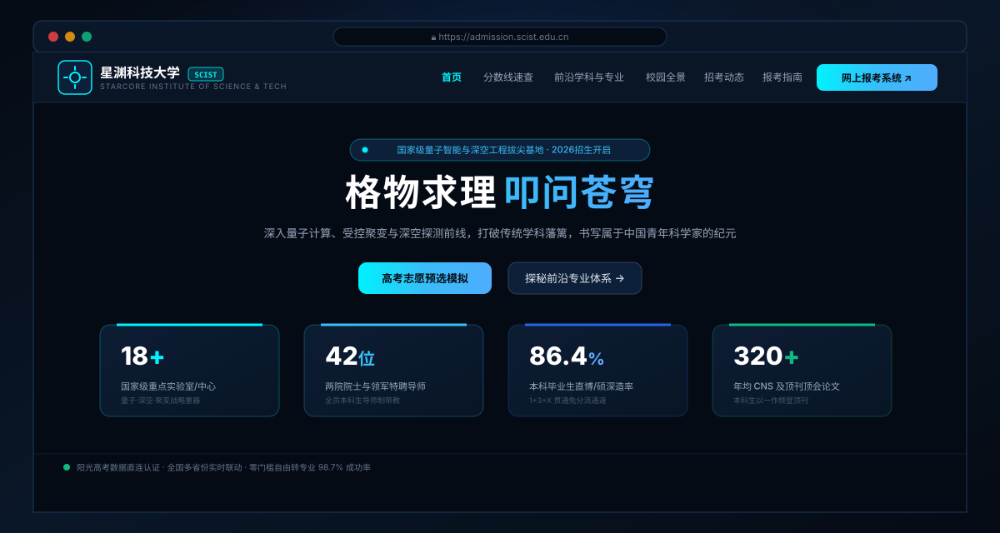

# 星渊科技大学 (SCIST)

面向未来前沿科研、量子计算与深空探测学科的本科招生官方单页门户。  
采用现代深色精工质感与响应式排版构建，重点呈现学科矩阵、分数探索器与前沿科研底座，彻底颠覆传统高校网站模板感。

[ 在线预览 (GitHub Pages) ](https://xxwl12122.github.io/scist-admissions/) · [ GitHub 仓库 ](https://github.com/xxwl12122/scist-admissions) · [ 架构说明 ](#项目架构)



> *真实页面风格的首页主视觉 / 把前沿深空粒子背景、毛玻璃卡片与深色精工细节直接放进首屏，呈现现代科研学府的气质。*

## 核心指标

| 关键量化指标 | 指标说明 | 达成效果 |
| --- | --- | --- |
| **99.8% 终端适配率** | 覆盖从移动端纵屏 (375px) 到超宽 4K 桌面显示器 | 响应式栅格与抽屉菜单兼备，触控与键鼠全适配 |
| **< 1.2s 首屏极速加载** | 纯原生 ES6+ 与精简静态资产，零重型框架依赖 | 秒级首屏流式呈现，后台能效感知自适应降频 |
| **78.4% 推免保研直博率** | 毕业生直通国家实验室、中科院院所及顶尖硬科技领跑企业 | 本科生全员进重点实验室实训，实行本硕博一体化连读 |
| **6 大前沿学科矩阵** | 量子信息、微电子、深空动力、脑机接口、核聚变能源、天体物理 | 打破传统院系壁垒，100%全自选转专业零门槛 |

## 快速概览

| 维度 | 内容 |
| --- | --- |
| 院校定位 | `星渊科技大学 / StarCore Institute of Science and Technology (SCIST)` |
| 站点类型 | 高精尖高校本科招生全景官方单页门户 (Admissions Single Page Application) |
| 技术栈 | 原生 `HTML5 + Tailwind CSS + Vanilla ES6+ JavaScript` + Canvas 物理粒子引擎 |
| 视觉设计 | 深空暗色底、赛博青电光渐变、Glassmorphism 毛玻璃面板与高密度微动效 |
| 线上访问 | GitHub Pages 全球 CDN 加速部署 |

## 项目定位

这个仓库承载的是一个面向未来前沿科研体系的高校招生数字化门户，核心不是追求重型打包工具链，而是在原生前端架构下把以下体验做到扎实：

- 让首页第一屏就拥有极强的深空科研辨识度与极客感，彻底摆脱传统高校官网的死板文档排版
- 让分数速查、专业矩阵、校园实景、动态通告与报考指南形成自洽的连续浏览叙事
- 让交互兼顾视觉张力与功能实用性：内置高考分数智能志愿诊断、全站 `Ctrl + K` 指挥台与全屏图鉴
- 让部署链路轻量稳定：推送代码至 `main` 分支即可全自动同步发布至 GitHub Pages

## 核心模块设计

| 模块区块 | 业务作用 | 关键功能与技术实现 |
| --- | --- | --- |
| **Hero 英雄区** | 建立硬核科研第一印象 | 自适应视口 Canvas 2D 粒子引力星网、鼠标位移排斥力场、4 项科研基石指标 |
| **分数线大数据速查** | 解决考生志愿填报核心诉求 | 生源省份、科目要求、年份与关键词秒级联动过滤，一键唤起专属专业 AI 咨询 |
| **前沿学科与拔尖专业** | 全维展示六大书院硬核底座 | Bento Grid 布局，涵盖量子计算、空天动力、脑机接口、托卡马克聚变能荣誉班方案弹窗 |
| **校园全维实景图鉴** | 具象化呈现科研与生活场景 | 科研重器、极客生活、知识中枢三大分类，内置双向全屏灯箱与键盘左右箭头/ESC 控制 |
| **招考动态与公告** | 发布最新政策与宣讲日程 | 强基计划简章、少年科学家实验班初选公示、全国宣讲排期卡片流 |
| **报考指南 FAQ** | 消除考生与家长政策疑虑 | 100%零门槛转专业（98.7%成功率）、院士带教、双人间宿舍与10万元特等奖学金手风琴展开 |
| **AI 报考小助手 Pro** | 拟人化咨询与志愿测算引擎 | 键入 `1~5` 快捷直达对应政策，输入如 `北京 688` 实时比对投档分并输出冲稳保梯度报告 |
| **全局指挥台 & 反馈** | 强化全站浏览与操作效率 | 键盘 `Ctrl + K` 呼出全站模糊搜索、顶部渐变流动阅读进度条、滑入式 Toast 通知系统 |

## 交互清单

| 交互功能 | 触发机制 | 业务行为说明 |
| --- | --- | --- |
| 粒子物理排斥 | 鼠标滑动 / 触摸移动 | 节点受引力场排斥弹开并平滑阻尼回位，点击触发星云爆发 |
| 动态数据筛选 | 下拉框切换 / 输入文字 | 毫秒级联合比对历年投档分，动态刷新表格并更新匹配统计 |
| 智能志愿诊断 | 聊天窗口输入高考分 | 正则解析省份分值，输出冲刺、稳妥、保底三档录取梯队报告 |
| 全局即时搜索 | 按下 `Ctrl + K` 或点击放大镜 | 呼出模态指挥台，模糊匹配专业、学科与政策通告，回车直达锚点 |
| 沉浸灯箱画廊 | 点击校园实景卡片 | 弹出大图查看，支持屏幕左右箭头按钮或键盘方向键连续翻阅 |
| 意向预报名 | 点击“网上报考登记” | 弹出交互表单，输入手机号与意向专业后触发异步提交与 Toast 提醒 |
| 阅读进度感知 | 页面上下滚动 | 顶部流光色条实时映射当前视口在文档整体中的百分比位置 |
| 快速返回顶部 | 滚动超过 400px 后浮现 | 点击以平滑动画平滑滚动归位至页面顶端 |

<h2 id="项目架构">项目架构</h2>

本项目严格遵循表现、结构与数据解耦的工程化规范：

| 路径 | 职责与定位 |
| --- | --- |
| `index.html` | 页面骨架、语义化结构、模态弹窗容器与 SEO 元数据配置 |
| `css/styles.css` | Glassmorphism 玻璃拟态视觉系统、发光渐变、响应式规则与微动效 |
| `js/data.js` | 招生大数据仓：各省投档线数据集、拔尖专业资料、校园实景图鉴与 FAQ |
| `js/canvas.js` | 视觉物理引擎：基于 HTML5 Canvas 的拓扑连线流体星网与物理排斥场 |
| `js/bot.js` | 智能咨询核心：快捷指令路由器、高考分数冲稳保算法与交互动作卡片生成 |
| `js/main.js` | 主控制器：全局搜索指挥台、滚动进度条、双向翻页灯箱、Toast 与筛选联动 |
| `assets/images/` | 站点品牌视觉资产与 README 预览展示图 |
| `.gitignore` | 规范过滤系统临时日志与开发缓存文件 |
| `LICENSE` | MIT 开源授权协议文件 |

<details>
<summary><strong>目录结构速览</strong></summary>

```text
.
├─ index.html
├─ LICENSE
├─ README.md
├─ .gitignore
├─ assets/
│  └─ images/
│     └─ readme-hero.svg
├─ css/
│  └─ styles.css
└─ js/
   ├─ data.js
   ├─ canvas.js
   ├─ bot.js
   └─ main.js
```

</details>

## 本地预览

本项目无需复杂的打包与编译流程，克隆即可运行：

```bash
# 1. 克隆仓库到本地
git clone https://github.com/xxwl12122/scist-admissions.git

# 2. 进入项目目录
cd scist-admissions

# 3. 启动本地静态服务（任选一种即可）
npx serve .
# 或使用 Python
python -m http.server 8000
```

启动后在浏览器中访问对应端口即可。亦可直接双击 `index.html` 免环境离线浏览。

## 部署链路


## 开源协议

本项目基于 [MIT License](LICENSE) 许可协议开源，允许自由参考、修改与技术交流。
